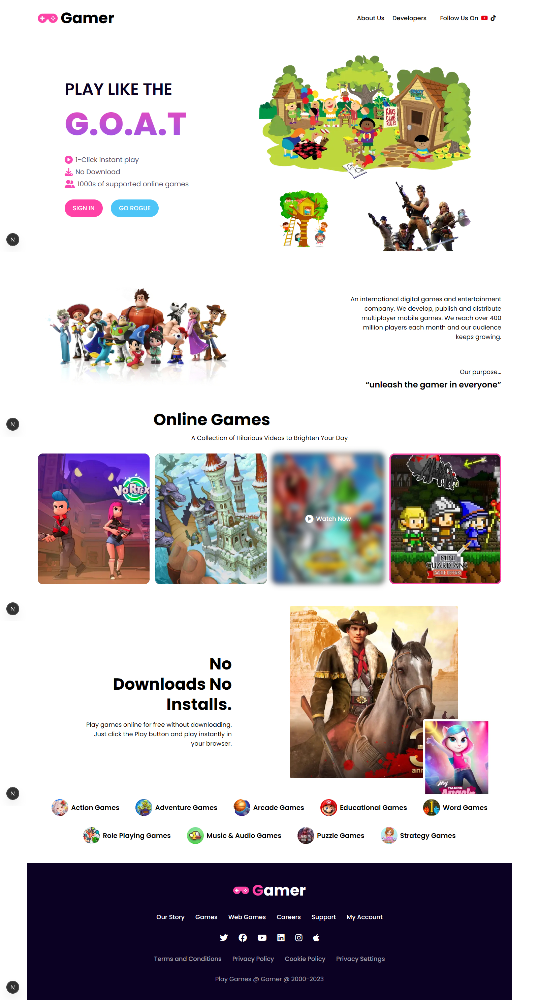

# 🎮 Gamer Showcase

Gamer Showcase is a **modern, sleek, and responsive landing page** for a gaming platform. Built with **Next.js 14**, **React 18**, **Tailwind CSS 4**, and **TypeScript**, it offers an engaging user interface with smooth animations and instant access to games without requiring downloads.

This project is fully optimized for an immersive experience across **mobile, tablet, and desktop devices**.


## 📸 Screenshots

| Desktop View                                           |
| ------------------------------------------------------ |
|  |


## 🛠 Built With

* [Next.js 14](https://nextjs.org/) – The React Framework for Production
* [React 18](https://react.dev/) – Component-based UI library
* [Tailwind CSS 4](https://tailwindcss.com/) – Utility-first CSS framework
* [TypeScript](https://www.typescriptlang.org/) – Static type checking
* [AOS](https://michalsnik.github.io/aos/) – Animate on scroll library
* [Font Awesome 6](https://fontawesome.com/) – Scalable vector icons (via CDN)
* [Google Fonts](https://fonts.google.com/) – Poppins and Work Sans fonts


## 📦 Getting Started

### 1️⃣ Clone the repository

```bash
git clone https://github.com/testfordb/game-website
cd game-websitegamer-showcase
```

### 2️⃣ Install dependencies

```bash
npm install
```

### 3️⃣ Run development server

```bash
npm run dev
```

Open [http://localhost:3000](http://localhost:3000) in your browser to see the app.


## 🚀 Deployment

You can deploy this Next.js app on **Vercel**, **Netlify**, or any Node-compatible server:

[](https://vercel.com/new/project)


## 📚 Learn More

* [Next.js Docs](https://nextjs.org/docs)
* [React Docs](https://react.dev/)
* [Tailwind CSS Docs](https://tailwindcss.com/docs)
* [TypeScript Docs](https://www.typescriptlang.org/docs/)
* [AOS Docs](https://michalsnik.github.io/aos/)


## 👨‍💻 Author

* **testfordb** – [GitHub](https://github.com/testfordb)


## 📜 License

This project is licensed under the MIT License.

